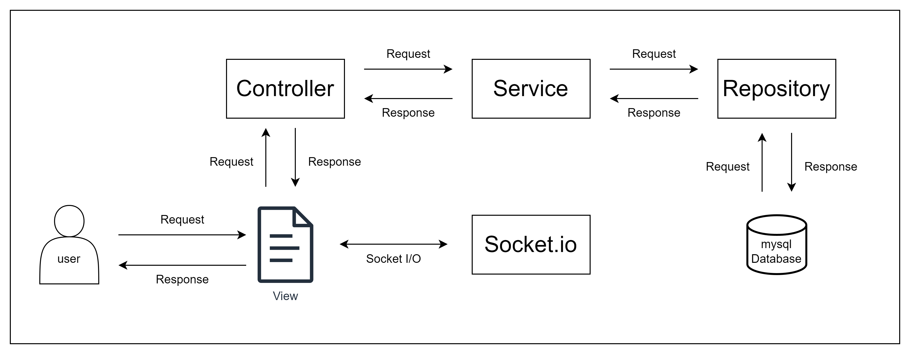

# Gamespring Simple Chatting Web APP Mission

## 디렉토리 구조

| 디렉토리 경로         | 설명                                           |
| --------------------- | ---------------------------------------------- |
| /docs                 | 서류, md에 필요한 이미지 모음, mysql 백업 파일 |
| /src                  | 소스코드 모음                                  |
| /src/controller       | Controller Layer 소스코드                      |
| /src/lib              | util 함수 소스코드                             |
| /src/modules          | 모듈                                           |
| /src/public           | 정적 리소스                                    |
| /src/repository       | Repository Layer 소스코드                      |
| /src/repository/model | ORM Model 정의                                 |
| /src/service          | ServiceLayer 소스코드                          |
| /src/views            | View 템플릿                                    |

## 아키텍처

- MVC 패턴과 3-Tier-Architecture를 지향했습니다.

### View

- 사용자는 브라우저를 통해 View 화면 내에서 Controller에 요청을 보내는 동작을 수행할 수 있고, 반영된 응답을 View에서 확인할 수 있습니다.

- View는 Socket.io와 직접 실시간으로 통신합니다.

### Controller

- Controller는 Request의 진입점 입니다.

- 사용자가 View를 통해 입력한 요청에 응답을 합니다.

### Service

- Service는 비즈니스 로직을 담당합니다.

- 필요에 따라 Repository에 DB 정보를 요청합니다.

### Repository

- Service에 요청에 따라 DB 작업을 수행하고 응답합니다.

## 사용 기술

- Node.js v18.15.0 LTS
  - Express.js
  - Socket.io
- mysql
  - ORM Tools : Sequelize

## API 엔드포인트 명세서

### 로그인/로그아웃/회원가입

| HTTP 메소드 | 엔드포인트 | 기능            |
| ----------- | ---------- | --------------- |
| GET         | /          | 로그인 페이지   |
| POST        | /login     | 로그인 로직     |
| POST        | /logout    | 로그아웃 로직   |
| GET         | /signin    | 회원가입 페이지 |
| POST        | /signin    | 회원가입 로직   |

### Rooms

| HTTP 메소드 | 엔드포인트 | 기능               |
| ----------- | ---------- | ------------------ |
| GET         | /rooms     | 채팅방 목록 페이지 |
| GET         | /rooms/1   | 1번 채팅방 페이지  |
| GET         | /rooms/2   | 2번 채팅방 페이지  |

### Users

| HTTP 메소드 | 엔드포인트      | 기능             |
| ----------- | --------------- | ---------------- |
| GET         | /users          | 유저 목록 페이지 |
| POST        | /users/{userId} | 친구 신청        |

### Friends

| HTTP 메소드 | 엔드포인트                       | 기능                  |
| ----------- | -------------------------------- | --------------------- |
| GET         | /Friends                         | 친구 목록 페이지      |
| GET         | /Friends/{userId}                | DM 페이지             |
| DELETE      | /Friends/{userId}                | 친구 삭제             |
| GET         | /Friends/request                 | 친구 요청 목록 페이지 |
| POST        | /Friends/request/{userId}/accept | 친구 요청 수락        |
| DELETE      | /Friends/request/{userId}/refuse | 친구 요청 거절        |
